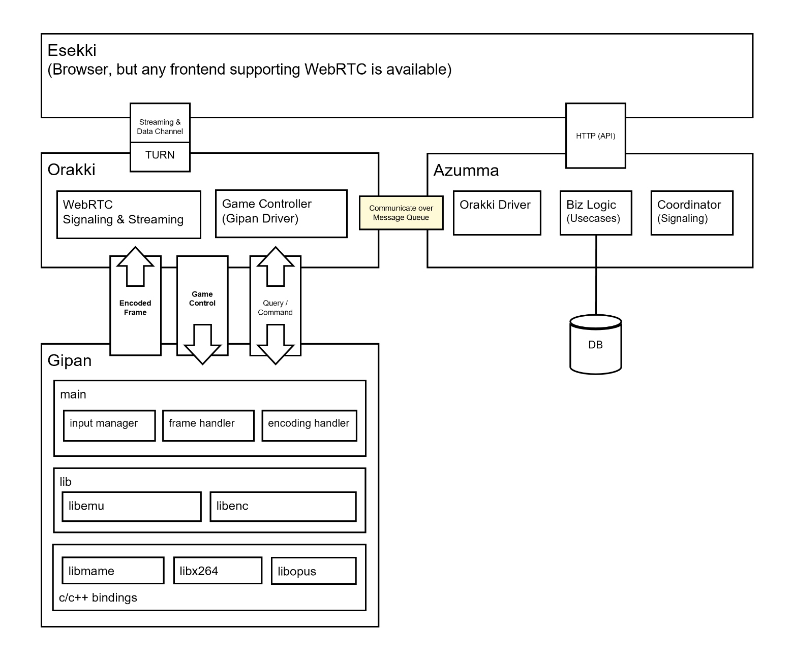
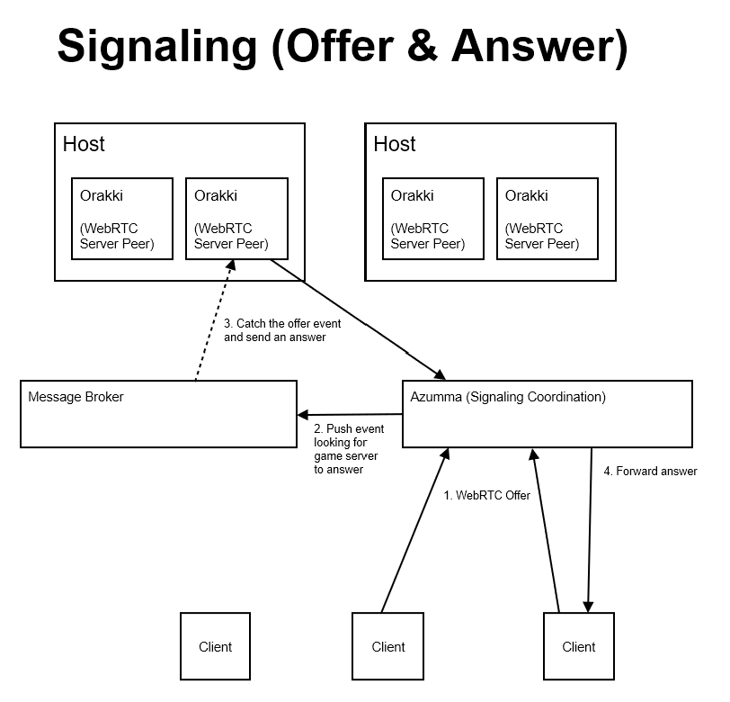
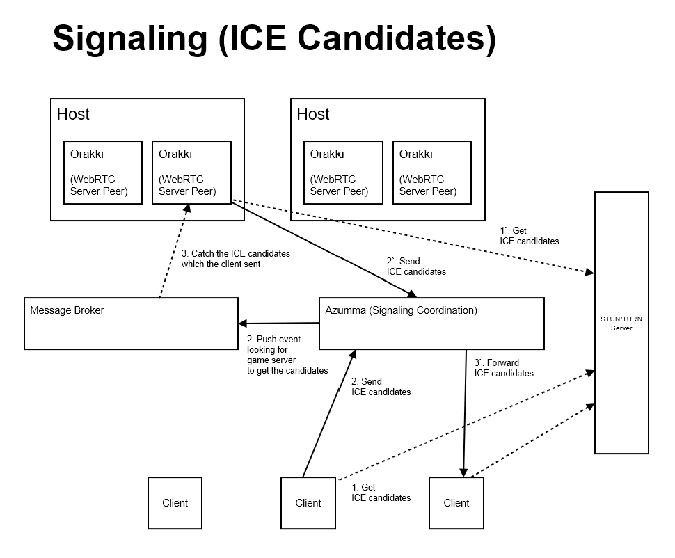

# ORAKSIL (추억의 오락실)

https://user-images.githubusercontent.com/2357381/148651036-8b7c5674-0c08-4e5e-aec7-29fe5b40c72f.mp4

_Captured by [Kropsaurus](https://kropsaurus.pineple.com/)_

## Give it a try

### Prerequisite

- Docker (with `docker-compose`)
- [MAME](https://github.com/mamedev/mame) Game ROMs
    - It's recommended that you get the game roms yourself due to some license issue.
    - The ROMs should be compatible to [MAME 0.223](https://github.com/mamedev/mame/releases/tag/mame0223)
    - Place ROM files under `./roms`

### Run
```
$ docker-compose up
```

If you'd like to play the specific game, use environment variable `GAME` by setting it to rom(zip) file name. For example, if you have `./roms/bublbobl.zip`
```
$ GAME=bublbobl docker-compose up
```

## How it works

### Sytem Architecture

#### Overview



#### Esekki (Frontend)

A web application running on a browser. It provides user with games catalog and to play game. Game frames to be rendered and player control data are transfered via WebRTC session. So, any kind of clients can be possible if it supports WebRTC. `Esseki` is built on [Next.js](https://nextjs.org/) using `redux`, `redux-saga` together.

#### Azumma (API Server)

`Azumma` is a REST API server that provides player creation, games catalog and WebRTC signaling proxy. In a cluster mode, it's responsible to provision `Orakki` instance on demand. It is built with [Golang](https://go.dev/).

#### Orakki (Game Streaming Server)

`Orakki` means an arcade gaming console in Korean. It is a core instance that provides clients with game streaming via WebRTC. It fetches encoded video/audio frames from `Gipan` and sends those packets to client. And it receives player controller input and forwards it to `Gipan`.

`Orakki` instance should be provisioned on demand in a cluster mode. It might need TURN server in some cases where client cannot communicate with server directly. It's built with Golang.

#### Gipan (MAME Emulator Driver & Encoder)

`Gipan` means a (green) main board in the game console box. It integrates MAME emulator as a game engine, encodes video/audio frames MAME renders and provides IPC or TCP channels for `Orakki` to fetch the encoded data. (It's the same for player control data) It's built with [Rust](https://www.rust-lang.org/).

### MAME as a lib

### Encoding game frames

### WebRTC Signaling

#### SDP



#### ICE Candidates



### Multiplaying

## Troubleshoot
- If you are stuck at creating a player on the modal form, please try to clear cookies and try again.
